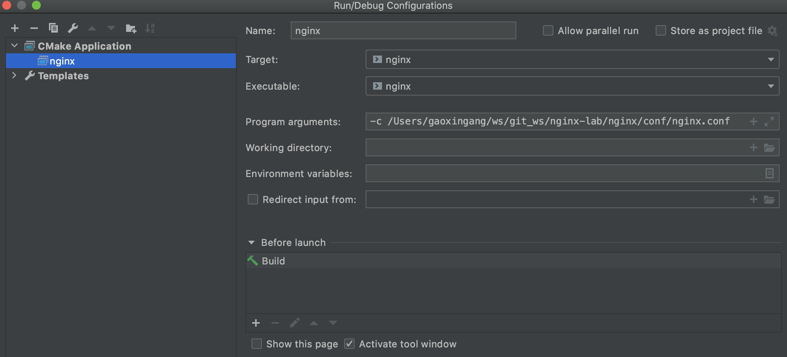
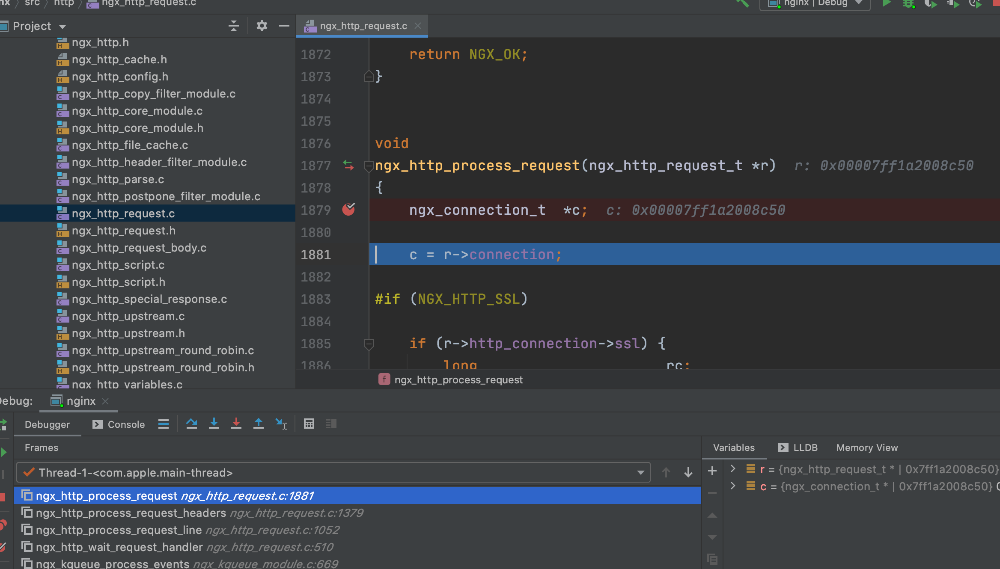

源码下载

    git clone https://github.com/nginx/nginx.git 
    切换到 1.14 分支
    
依赖
    
    openssl-1.0.2u， pcre-8.41， zlib-1.2.11 自行下载
    
nginx/auto 里增加 cmake文件

    cmake文件参考项目下的
    
编译nginx
    
    --prefix=/Users/gaoxingang/ws/git_ws/nginx-lab/mynginx --with-pcre=/Users/gaoxingang/ws/git_ws/nginx-temp/pcre-8.41 --with-openssl=/Users/gaoxingang/ws/git_ws/nginx-temp/openssl-1.0.2u --with-http_ssl_module --with-http_v2_module
    编译后生成objs目录，和CMakeLists.txt
    
配置
   
conf/nginx.config 修改配置，增加

    daemon off;
    master_process off;
   
修改运行配置

      
   
ngx_http_request.c ngx_http_process_request 方法里加断点，启动服务，命令行执行 curl localhost

      
   
参考
    
    https://blog.csdn.net/liaomin416100569/article/details/105127557
