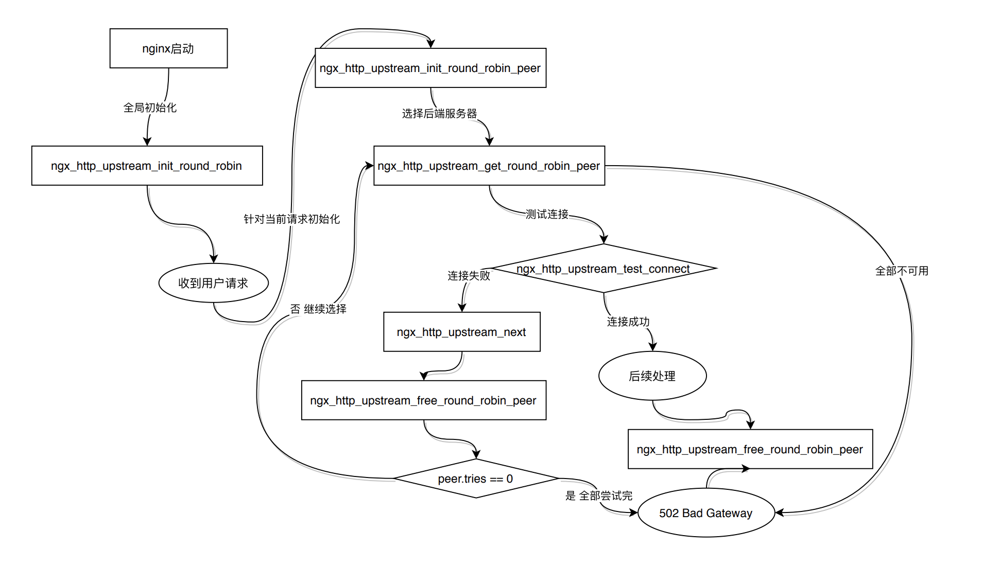

负载均衡策略

    如果不做任何配置，Nginx默认采用加权轮训策略
    
    upstream order {
        ip_hash;
        server 127.0.0.1:8081;
        server 127.0.0.1:8082;
    }
    
    配置指令ip_hash对应的回调处理函数为，ngx_http_upstream_ip_hash
    
    当整个Http配置模块被Nginx解析完后，会调用各个http模块对应的初始函数 ngx_http_upstream_init_main_conf
    
    ngx_http_upstream_module 初始函数为 ngx_http_upstream_init_main_conf
    
    static char *
    ngx_http_upstream_init_main_conf(ngx_conf_t *cf, void *conf)
    {
        ...
    
        for (i = 0; i < umcf->upstreams.nelts; i++) {
    
            // 默认使用加权轮训策略，如果有选择的策略，使用 uscfp[i]->peer.init_upstream 指针函数
            init = uscfp[i]->peer.init_upstream ? uscfp[i]->peer.init_upstream:
                                                ngx_http_upstream_init_round_robin;
    
            if (init(cf, uscfp[i]) != NGX_OK) {
                return NGX_CONF_ERROR;
            }
        }
        
        ...
        
        return NGX_CONF_OK;
    }
    
加权轮训
    
    实现上需要考虑很多细节，比如各个服务器有不同的权重，某个服务多次连接失败或处理出错后，
    在一定时间内不再参与被选择等。
    
    upstream 上下文内，server配置可以带的参数有如下几个
    
    upstream order {
        server order.gxg.com weight=5
        server 127.0.0.1:8081 max_fails=3 fail_timeout=30s;
        server 127.0.0.1:8082 down;
        server UNIX:/tmp/order backup;
    }
    
    1 weight:权重 默认值为1，与加权轮训策略配合使用
    2 max_fails fail_timeout:需要配合使用,默认值分别为1，10s。
      表示如果某台后端服务器在 fail_timeout 时间内 发生了 max_fails链接失败
      那么该后端服务在fail_timeout 时间内就不再参与被选择，直到fail_timeout 时间后
      才重新加入而有机会被选择
    3 backup:备机，标识为宕机状态，不参与被选择
    
    在配置解析过程中，这些选项设置都被转换为Nginx内对应的变量值，对应结构体如下：
    
    typedef struct {
        ngx_str_t                        name;
        ngx_addr_t                      *addrs; // 数组指针
        ngx_uint_t                       naddrs; // 数组元素个数
        ngx_uint_t                       weight;
        ngx_uint_t                       max_conns;
        ngx_uint_t                       max_fails;
        time_t                           fail_timeout;
        ngx_msec_t                       slow_start;
        ngx_uint_t                       down;
    
        unsigned                         backup:1;
    
        NGX_COMPAT_BEGIN(6)
        NGX_COMPAT_END
    } ngx_http_upstream_server_t;
    
    文件 ngx_http_upstream_round_robin.c 函数ngx_http_upstream_init_round_robin
    除了把配置解析后的结果转存到相应的变量以外，主要还有以下几项
    
    创建后端服务列表
    选择后端服务器
    后端服务器权值计算
    释放后端服务器
    
    加权轮训流程图
    
      
    
